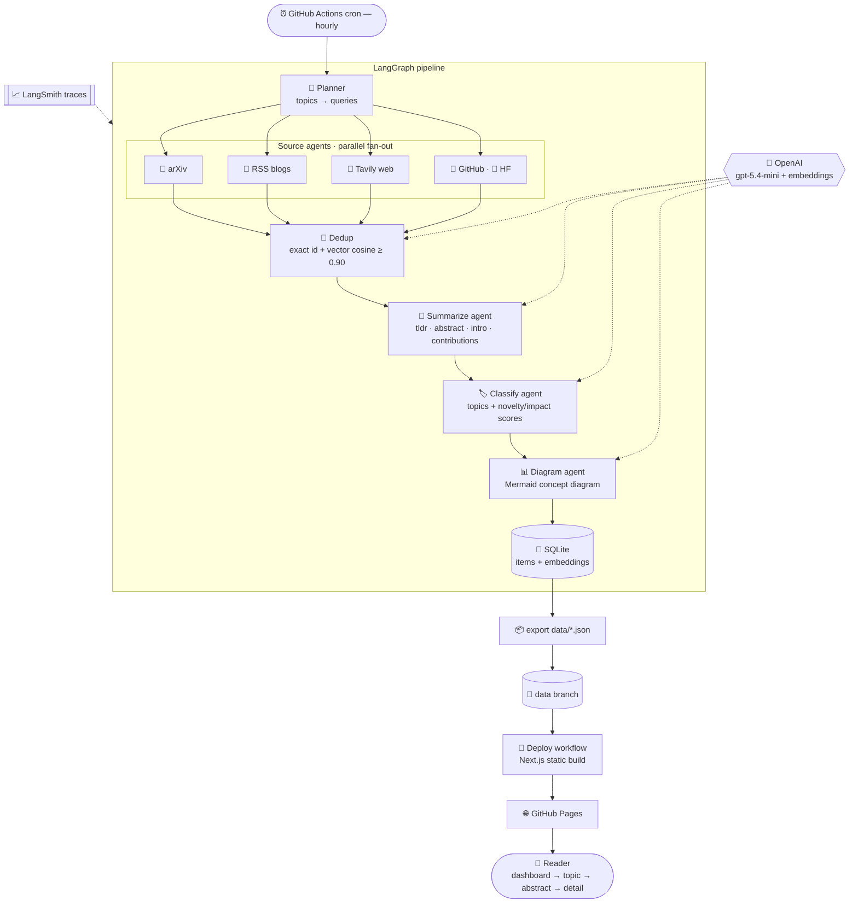

# MASResearcher

Autonomous multi-agent research feed for **Physical AI**, **Multi-Agent Systems**, and **Vision AI**.

Every hour a LangGraph pipeline discovers new papers, blogs, solutions, and repos across those three topics, enriches each with a structured summary + concept diagram using an LLM (OpenAI `gpt-5.4-mini`), and publishes static JSON that a hierarchical UI renders (dashboard → topic → abstract → detail). The whole thing runs on GitHub — Actions cron for the pipeline, Pages for the site — so there's no server to run.

## How the multi-agent system works

A single hourly GitHub Actions run drives a LangGraph graph of agents: a planner fans out to four **source agents** in parallel, their results are de-duplicated (exact + embedding cosine), then three **enrichment agents** (summarize → classify → diagram) process each item before it's persisted and published to the static UI. An LLM backs the enrichment agents and the embeddings; LangSmith traces every node.



## Status

- **Phase 0 (scaffold)** ✅ — package layout, config, schemas, SQLite store, LangGraph skeleton, JSON exporter, CI drafts.
- **Phase 1 (arXiv + LLM summaries)** ✅ — live arXiv source (category × topic-query search, lookback filtered, per-topic failures recorded to run stats) and **provider-agnostic** structured summaries (tldr → abstract → introduction → contributions → why-it-matters + tags). Works with **OpenAI** (`OPENAI_API_KEY`, e.g. `gpt-5.4-mini`) or **Anthropic** (`ANTHROPIC_API_KEY`) — whichever key is set (OpenAI wins if both). Falls back to a stub per-item when no key or on error, so runs never hard-stop.

- **Phase 2 (multi-source + vector dedup)** ✅ — three more parallel source branches: curated **RSS** blogs (feedparser), **Tavily** web search (news-scoped, needs `TAVILY_API_KEY`), and **GitHub repo search + HuggingFace daily papers** (unauthenticated). Added **near-duplicate dedup** via OpenAI `text-embedding-3-small` (cosine ≥ 0.90) so the same paper surfaced across sources collapses to one item; embeddings persist for future-run comparison. Every source records failures to run stats instead of failing the run.

- **Phase 3 (classify + diagrams)** ✅ — two more LLM agents as their own nodes: a **classifier** (assigns topics from the fixed set + novelty/impact scores 0-1 for ranking) and a **diagram agent** (emits a concise, validated Mermaid `flowchart` concept diagram per item). Per-item LLM calls run concurrently (thread pool) so the summarize → classify → diagram chain stays fast. Chain: `dedup → enrich → classify → diagram → persist`.

- **Phase 4 (hierarchical UI)** ✅ — Next.js static-export app in `web/`. **L0** dashboard (total + per-topic counts, items/run sparkline, live-updated timestamp), **L1** topic-grouped sortable cards (newest / novelty / impact, topic filter chips), **L2/L3** detail drawer (tldr → **rendered Mermaid diagram** → abstract → introduction → contributions → why-it-matters → source link). Reads `data/*.json` at runtime and re-polls every 10 min so hourly updates appear without a reload. Builds clean to a static export for Pages.

Roadmap: **P5** enable Actions cron + Pages (wire secrets, first live hourly runs).

## Preview the UI locally

```bash
cd web
npm install
mkdir -p public/data && cp ../data/*.json public/data/   # sample data for preview
npm run build
python3 -m http.server 8099 --directory out               # open http://localhost:8099
```

## Layout

```
masresearcher/        Python pipeline
  config.py           settings + TOPICS
  models.py           Pydantic schemas (RawItem, EnrichedItem, RunStats)
  state.py            LangGraph state
  store.py            SQLite + dedup memory
  graph.py            StateGraph assembly
  nodes/              planner, dedup, enrich, persist
  sources/            demo (P0); arxiv/rss/tavily/github_hf (P1+)
  export_json.py      SQLite → data/*.json
  run.py              entrypoint (python -m masresearcher.run)
web/                  Next.js static UI (P4)
.github/workflows/    pipeline.yml (cron), deploy.yml (Pages)
```

## Local dev

Requires Python **3.11+** (LangGraph). On macOS: `brew install python@3.11`.

```bash
python3.11 -m venv .venv && source .venv/bin/activate
pip install -e .
cp .env.example .env        # set OPENAI_API_KEY (or ANTHROPIC_API_KEY); Tavily/LangSmith optional
python -m masresearcher.run # writes data/*.json + state/seen.sqlite
```

Phase 0 runs with no keys (demo source, stub enrichment) so you can verify the plumbing.
